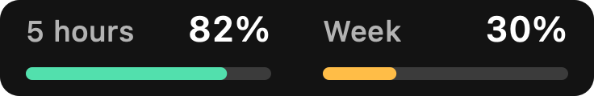
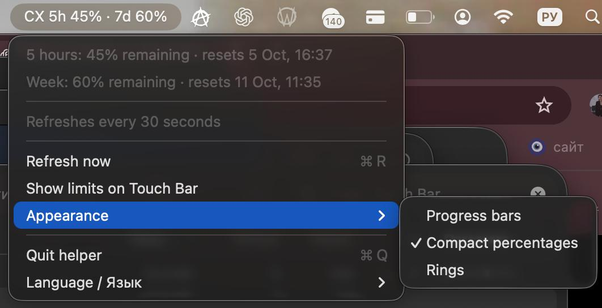
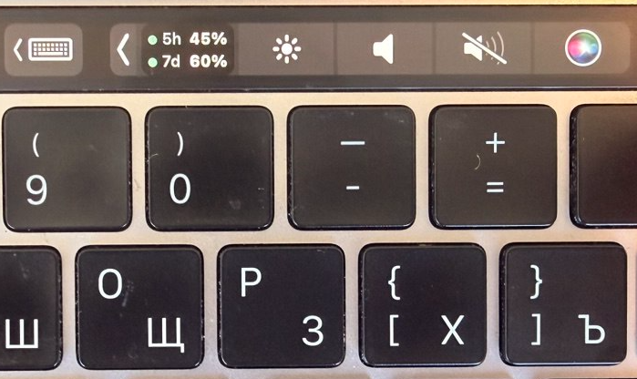
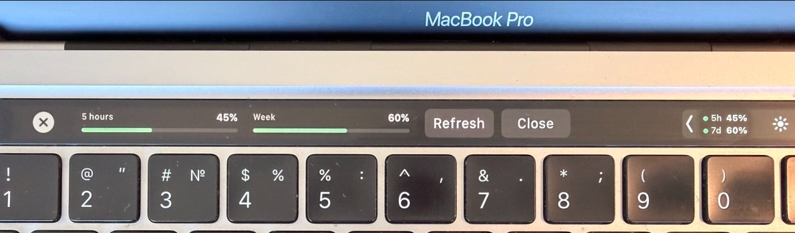

# Codex Touch Bar

**Your Codex limits, one glance above the keyboard.**

A lightweight macOS helper that displays the remaining **five-hour** and
**weekly** Codex quotas on a MacBook Pro's Touch Bar. It appears when ChatGPT
or Codex is running and hides when both apps are closed.



*Illustrative preview: 82% of the five-hour quota and 30% of the weekly quota remain.*

[Русская инструкция](README.ru.md)

## Features

- A narrow, two-line Touch Bar indicator for the five-hour and weekly quotas that fits the Control Strip.
- Tap the indicator to expand into two full progress bars with remaining percentages.
- Green, amber and red indicators as your quota runs low.
- Three display styles: progress bars, compact percentages and rings.
- Choose a style from **CX → Appearance** in the menu bar; your choice is saved.
- English, Russian and macOS language selection are available from **CX → Language / Язык**.
- Reset countdowns are shown in the menu-bar menu.
- Menu-bar fallback with percentages and reset dates.
- Automatic refresh every 30 seconds, login autostart, and reasserted Control Strip visibility after macOS rebuilds its customization UI.
- Missing, expired or failed readings display a dash, never a guessed quota.

## Requirements

- A MacBook Pro with a physical Touch Bar.
- macOS 13 or later. Universal binary: Apple silicon and Intel.
- ChatGPT/Codex desktop app with its bundled Codex CLI, or Codex CLI installed
  at `/opt/homebrew/bin/codex` or `/usr/local/bin/codex`.
- An existing ChatGPT-backed Codex login that provides quota windows.

The interface supports English and Russian, or follows the macOS language. A Touch Bar
cannot be added to a Mac without the hardware. Quota fetching, autostart and the compact
indicator were verified on an M1 MacBook Pro with macOS 26.5. The updated tap-to-expand
button in v1.2.1 needs a check on the physical panel. Intel compatibility is compiled but
not hardware-verified. This is an **experimental preview release**.

## Download and install

1. Open this repository's **Releases** and download
   `CodexTouchBar-v1.2.1-universal.zip`.
2. Extract the ZIP into a folder.
3. Run `Install.command` from that folder. It installs the app in
   `~/Applications` and a login agent in `~/Library/LaunchAgents`.
4. Open ChatGPT or Codex. Look for **CX** in the menu bar and the quota widget
   in the Touch Bar's Control Strip area. Expand the Control Strip if needed.

You can also launch the extracted app manually without installing autostart.
This release is locally signed, **not Apple-notarized**. macOS may ask you to
approve opening it. No administrator password is needed. If you prefer to
inspect the code first, follow the build instructions below.

## How it works and privacy

The helper starts the installed CLI using `codex app-server --stdio`, reads
`account/rateLimits/read`, and calculates remaining usage as `100 − usedPercent`.
It selects the `codex` quota bucket and matches windows by their reported
durations: 300 minutes and 10,080 minutes. Different or unavailable windows
are not relabeled as five-hour/weekly limits.

Authentication stays with the existing Codex installation. The helper does not
copy credentials, collect analytics, create chats, or send prompts to a model.
It needs network access through Codex to fetch account limits. A local
`CodexTouchBar-status.json` file beside the installed app records display state
and percentages for troubleshooting, without credentials or raw account data.

The official quota protocol is documented in [Codex App Server](https://learn.chatgpt.com/docs/app-server).
The persistent Touch Bar widget uses **private macOS APIs** checked at runtime.
Those APIs can change in future macOS releases; the menu-bar view remains
available if they disappear. This is an independent project, not an official
OpenAI or Apple product.

## Build from source

Install Apple's Command Line Tools, then run:

```sh
bash build.sh
```

The script builds both CPU architectures, signs the app locally, verifies its
signature, runs quota-handling tests, renders the preview from the actual view
code, and creates the ZIP and SHA-256 checksum in `dist/`.
It requires no third-party libraries or package manager.

## Troubleshooting

- **Dashes instead of percentages:** make sure the installed CLI is signed into
  your ChatGPT account, then choose **CX → Refresh now / Обновить сейчас**. An API-key-only
  setup does not provide your ChatGPT subscription quota.
- **Menu bar works, Touch Bar doesn't:** expand the Control Strip. A macOS
  update may also have changed the private Touch Bar interface.
- **Nothing appears:** the helper hides while ChatGPT/Codex is closed.
- **Stopped the helper:** launch the installed app again, or sign out and back
  into macOS. Choosing “Quit helper / Выключить помощник” stops it until the next launch.

To report a problem, include the macOS version, Mac model, and behavior.
Please do not upload `~/.codex/auth.json`, access tokens or other credentials.

## Uninstall

Run `Uninstall.command` to stop the helper and remove its login agent.
Move `~/Applications/Codex Touch Bar.app` to the Trash to remove the app.
Codex itself, your login, chats and settings are not removed.

## License

MIT. See [LICENSE](LICENSE).

Choose **CX → Language / Язык → English**, **Русский**, or **System / Как в macOS**. Changes apply immediately and are saved. Quotas refresh every 30 seconds.


## Real photos

These photos show the app on a MacBook Pro:






